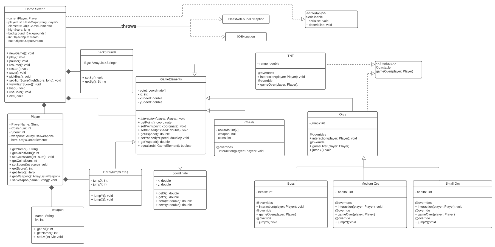

## Project to test whether we can implement the game using UI library such as (JavaFX).
### UML:

### This was just a fun project for testing.
### Please note that some features were implemented from scratch, such as:
- AABB collision detection
- Game event loop in a separate thread
- Level creation and management
- Player controller
- etc.

### Game engines (Unity, Godot etc.) include proper tool set for such tasks.
